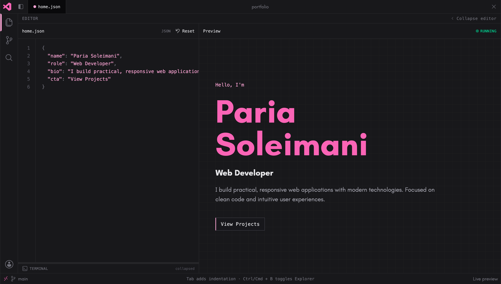

# My Personal Portfolio
An interactive developer portfolio styled like a VS Code workspace. Edit JSON and CSS in the left pane and watch the live preview update on the right.

## Features
- Home, About, Projects, and Contact routes presented as editable workspace files
- Live preview that syncs as you type — change content in JSON or restyle Contact with CSS variables
- Syntax-highlighted editor with line numbers, reset, and a collapsible terminal for parse/fetch errors
- File explorer and sidebar navigation with keyboard toggle (`Ctrl/Cmd + B`)
- Projects page fed by the GitHub API, with filterable preview options from `projects.json`
- Resizable terminal panel and collapsible editor column

## Tech stack
#### Front End
- Next.js, React
- Tailwind CSS

#### Tools
- Bun, Biome

## Contact
If you have any questions, feedback, or suggestions regarding the project, feel free to contact me!

  
  
  